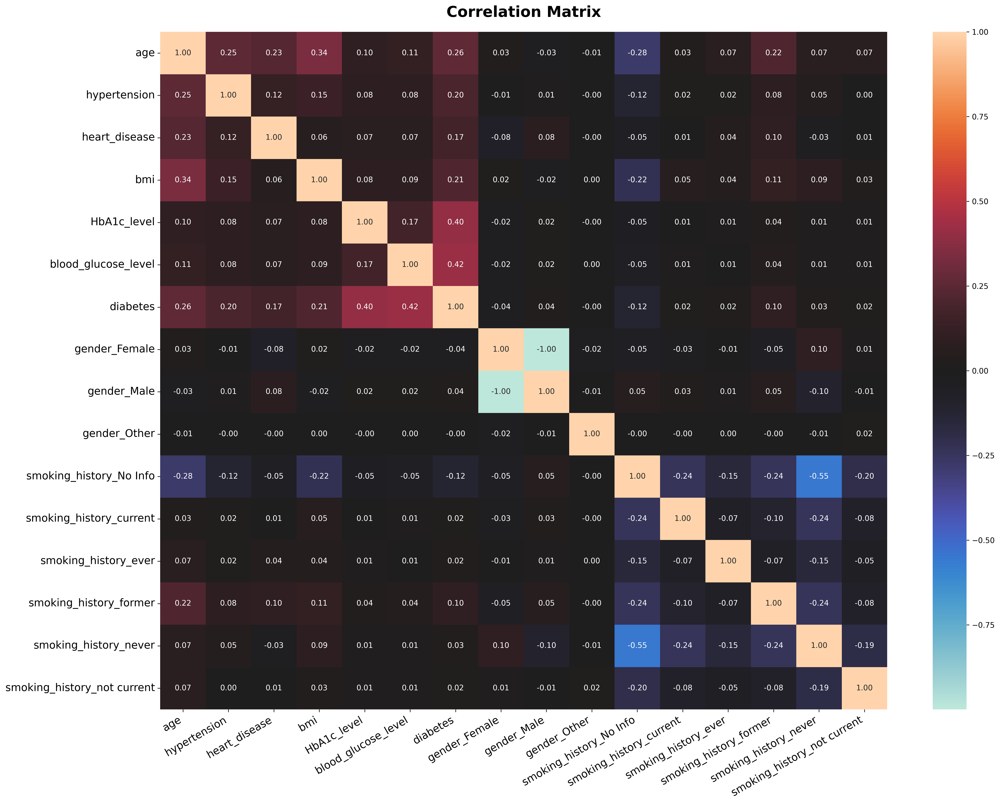
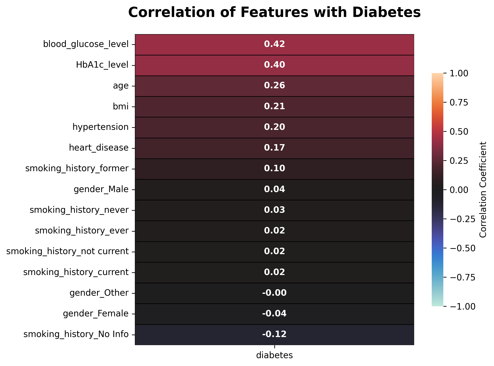
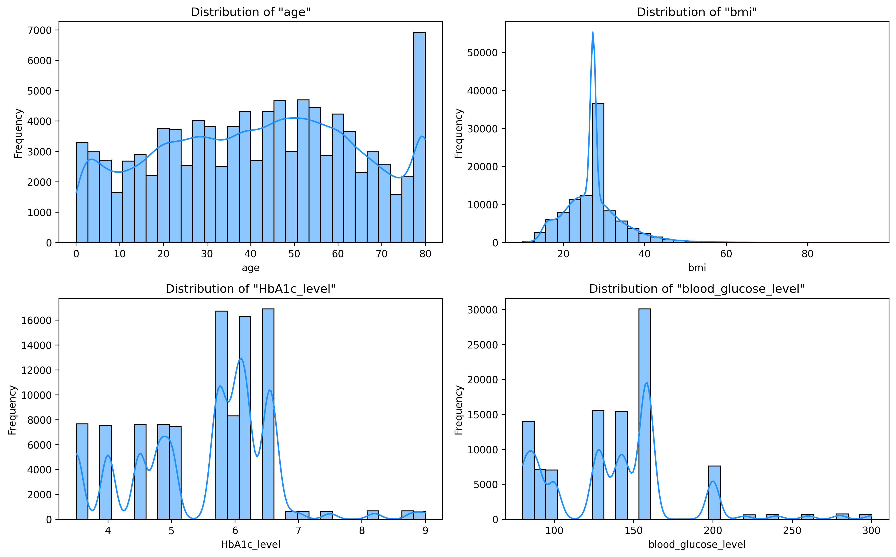
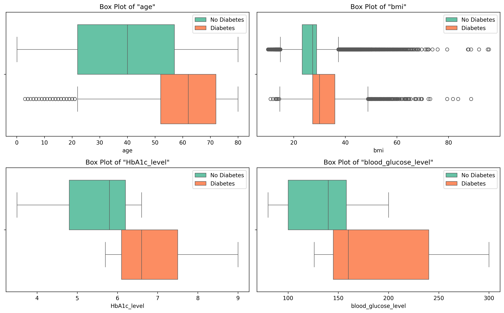
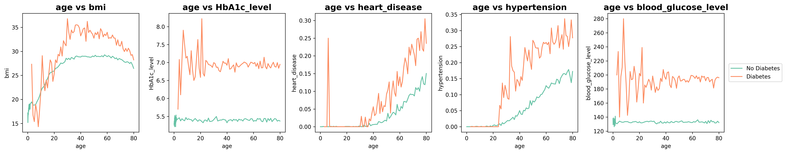
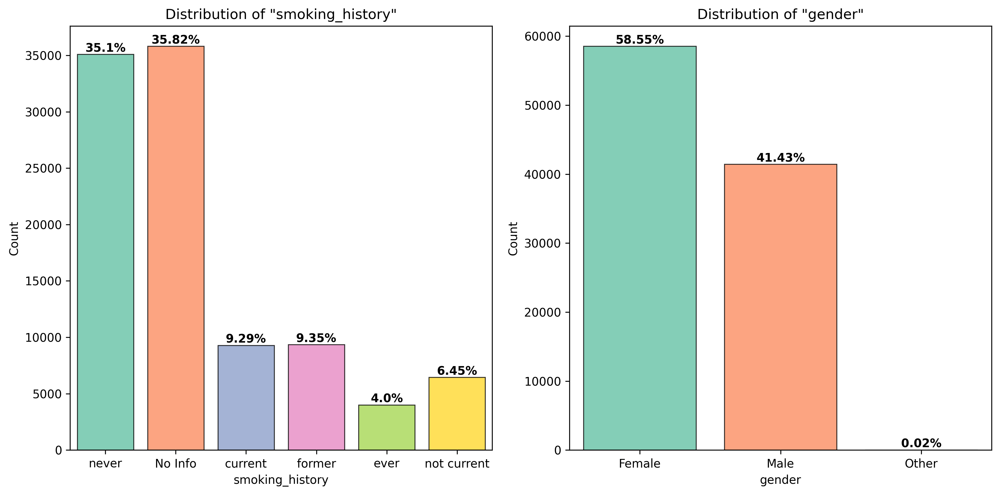

# Predicting Diabetes Using Machine Learning Models
### Georgia Tech - Machine Learning I | Parth Patel | 2024

**In this project, we investigated the correlation between physical attributes and the likelihood of diabetes diagnosis. This was accomplished by comparing the robustness of six classification models: Neural Net, Random Forest, Logistic Regression, Naive Bayes, KNN, and SVM**

___

This project involved sourcing the dataset, carrying out exploratory data analysis, fixing missing values and outliers, and fitting various classification models to predict diabetes diagnosis. 

**Key Findings:**
- As evident from the table below, Random Forest was the most effective predictive model for understanding the relationship between diabetes and the given features in this dataset. Other models like Neural Net and KNN performed relatively well with high F1 scores whereas Naive Bayes performed the worst. 

| Ranking | Model               | Train Accuracy | Test Accuracy | F1 (weighted) |
|---------|---------------------|----------------|---------------|---------------|
| 1       | Random Forest       | 0.9721         | 0.9709        | 0.9682        |
| 2       | Neural Network      | 0.9724         | 0.9706        | 0.9680        |
| 3       | KNN                 | 0.9701         | 0.9617        | 0.9587        |
| 4       | Logistic Regression | 0.9606         | 0.9590        | 0.9559        |
| 5       | SVM                 | 0.9612         | 0.9597        | 0.9555        |
| 6       | Naïve Bayes         | 0.9034         | 0.9024        | 0.9099        |

- Through our analysis, *HbA1c_level* and *blood_glucose_level* were the two most significant features for predicting diabetes. Further investigation into these features could involve examining their correlations or creating a composite feature to assess its predictive power against diabetes. 

**Exploratory Data Analysis:**
- Confusion matrix of all features 
  > 
- Correlation of features with diabetes 
  > 
- Histograms of numerical features 
  > 
- Box and whisker plots of numerical features 
  > 
- Comparison Between Age and Various Features vs Diabetes Diagnosis
  > 
- Bar Graphs for Smoking History and Gender Categorical Features as a Portion of the Dataset
  > 
